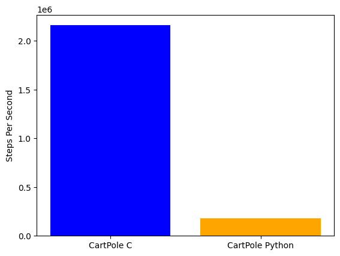

# Cartpole.c
This is a very simple repo showing basic implementations of designing an RL environment using only the C programming language. Compared to the standard Gymnasium environment, we can get over 12x performance boost on just a CPU! 

The code is designed to be simple and easy to read. There is certainly many performance improvements that can be made, but it is primarily an educational example. 

# Quick Start

```bash
# create the package
make build

# install to python
make install
```

```python
import cartpole
import random

# initialize the environment
env = cartpole.CartPoleEnv()
state = env.reset()
print("Initial State:", state)

done = False
time_steps = 0
max_time_steps = 500
num_episodes = 10

# run for some episodes
for _ in range(num_episodes):

    while not done and time_steps < max_time_steps:
        # Agent selects a random action
        action = random.randint(0, 1)

        # take a step in the environment
        state, reward, done = env.step(action)

        print(f"Time Step: {time_steps}, Action: {action}, State: {state}, Reward: {reward}, Done: {done}")
        time_steps += 1

    if done:
        time_steps = 0
        done = False
        print(f"Episode terminated after {time_steps} time steps.")
    else:
        print(f"Episode reached max time steps ({max_time_steps}).")

    env.reset()
```

Additionally, there is an example [notebook](notebooks/ppo.ipynb). using the environment to train a full PPO agent using the excellent single file implementation from [CleanRL](https://github.com/vwxyzjn/cleanrl/blob/master/cleanrl/ppo.py). This example is still limited as it is using the Gym Vectorised environment wrapper instead of handling the parallelisation on the C side. However, it shows a nice example of using it in practice. 

# Performance
The performance of this implementation is significantly faster than the standard Gymnasium environment. This is of course due to the fact that the Gymnasium environment is written in Python, and this implementation is written in pure C. As you can see from the comparison below, the C implementation is over 12x faster than the Python implementation. 



You can play with a simple random agent using the code above and comparing it to the standard Python environment for yourself in the [benchmarking notebook](notebooks/benchmarking.ipynb).

# References
- [Cartpole Environment](https://gym.openai.com/envs/CartPole-v1/)
- [CleanRL PPO](https://github.com/vwxyzjn/cleanrl/blob/master/cleanrl/ppo.py)